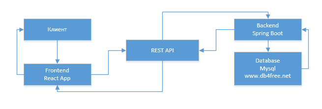

# Тестовое задание "Справочник автомобилей" - backend

Этот проект был создан с помощью [Spring](https://start.spring.io).
В данном проекте реализован сервис справочника автомобилей с хранением
данных в базе\
Использована бесплатная [БД MySQL](https://www.db4free.net/) Возможна задержка ответа от БД:(

Реализованы основные операции для хранения информации об автомобилях: добавление, удаление, редактирование
\
Для удобства тестирования в корне проекта в файле "car guide.postman_collection.json" экспортирована коллекция запросов к API

http://localhost:8080
чтобы взаимодействовать с API

## Docker
Так же вы можете [скачать docker образ](https://hub.docker.com/r/daniilamark/cars) с dockerhub

### `docker pull daniilamark/cars`

## Frontend
[github carscatalog-frontend](https://github.com/daniilamark/carscatalog-frontend)
